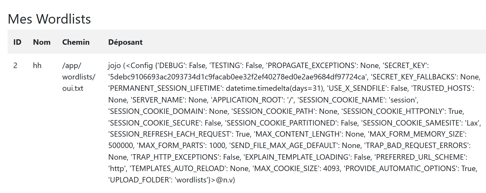
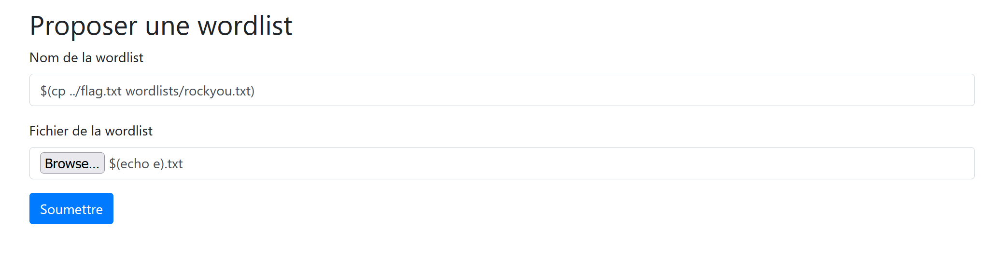

# Le but est d’obtenir le fichier `flag.txt` stocké dans le site web.

## intro

Dans le dossier `app` on peut reconnaitre un site web créé avec **Python** et **Flask**.

Dans le fichier `_init_.py` on voit qu’un compte admin est créé avec un mot de passe aléatoire :
```python
users.add(
    username='admin',
    email='admin@crackedstation.com',
    password=os.urandom(32).hex(),
    description='I am the greatest of all time.',
    is_admin=True
)
```

Dans la fonction **wordlist_download()** du fichier principal du site `route.py` voit une possibilité de *Command Injection* dans les lignes :
```python
    if subprocess.Popen(f'ls "{wordlist[2]}"', shell=True, stdout=subprocess.PIPE).stdout.read() == b'':
        if subprocess.Popen(f'ls "{wordlist[1]}"', shell=True, stdout=subprocess.PIPE).stdout.read() == b'':
            return abort(404)
```

Le programme exécute la commande Linux **ls** pour vérifier que le nom du fichier existe bien dans le dossier pour pouvoir le télécharger. S'il n'existe pas, alors il passe à l’autre **if** qui va à son tour vérifier si un fichier qui a le nom qu’on lui a donné sur le site existe, sinon il renvoie une erreur.

La faille *Command Injection* va nous permettre d'exécuter des commandes Linux afin de récupérer notre flag.

D'après la BDD (Base De Données) du site, on a :

![representation de wordlist[1] et wordlist[2]](./image1.png)

Mais pour utiliser cette faille, on doit d'abord pouvoir télécharger notre wordlist, et sur ce site une wordlist est téléchargeable uniquement si un admin l'a approuvée. On doit donc obtenir le compte admin existant.

## I obtenir le compte admin

Dans `Wordlist.py`, en regardant de plus près la template Jinja2 pour la page /profile, on voit que **user[2]** est incrusté dans la template sans aucune vérification de son contenu, ce qui peut exposer le site à un *Server-Side Template Injection* qui consiste en une injection de code Jinja2 pour, dans notre cas, consulter des données sensibles.

Dans la BDD, **user[2]** correspond à l'email de l'utilisateur, donc on pourrait utiliser un payload en tant que email, cependant on est limité sur ce que l'on peut faire car à la création du compte l'email est filtré :
```python
if "@" not in email or "." not in email.split("@")[-1] or any (c in "<>_ " for c in email): return render_template('register.html', error="ERROR: Invalid email address")
```

On n'a pas le droit d'utiliser `<`,`>`,`_` et l'espace, il est donc très compliqué de récupérer le fichier `flag.txt` avec cette injection.

Par contre, on peut afficher toutes les variables de app.config avec `{{config}}`.

Pour exploiter cette faille, on va créer un compte avec comme email `{{config}}@fake.com`, on upload une wordlist random et on va sur la page /profile, ce qui nous donne ça :



Dans tout ce charabia, il y a une variable très intéressante, la variable **SECRET_KEY**, initialisée dans `_init_.py` qui, dans le contexte d'une application Flask, permet de créer/signer un token d'utilisateur valide pour accéder au site, ce qui veut dire qu'on peut créer/signer nous-mêmes le token de la fameuse session admin.

Dans `routes.py` on voit les paramètres pris en compte par le site :
```python
if user:
    user = users.get(username=username)
    session['id'] = user[0]
    session['username'] = user[1]
    session['is_admin'] = user[5]
    return redirect(url_for('index'))
```

On va donc recréer le même fonctionnement dans notre propre script Python pour la session admin.

Je vous présente **ADMIN SESSION TOKEN GENERATOR 3000!!!**
```python
from flask import Flask
from flask.sessions import SecureCookieSessionInterface

SECRET_KEY = "..."

app = Flask(__name__)
app.secret_key = SECRET_KEY

session_serializer = SecureCookieSessionInterface()\
    .get_signing_serializer(app)

# Donnees de session admin
session_data = {
    'id': 1,  # ont utilise l'id du premier utilisateur
    'username': 'admin',
    'is_admin': True,
    '_permanent': True  # obligatoire pour que le site accepte le token
}

token = session_serializer.dumps(session_data)
print(f"Token trop cool : {token}")
```
Avec une extension Chrome comme [cookie editor](https://chromewebstore.google.com/detail/cookie-editor/hlkenndednhfkekhgcdicdfddnkalmdm) on va remplacer notre token actuel par celui généré par le script et boom ! On est login en admin et on peut enfin valider des wordlists !

## II obtenir le flag.txt avec une injection de commandes

Reprenons les recherches commencées dans l'intro, notre but va être de copier le contenu de flag.txt dans rockyou.txt (qui est la wordlist déjà présente sur le site) pour après la télécharger.

Il faut faire la commande Linux `cp ../flag.txt wordlists/rockyou.txt`, on peut donc essayer de mettre cette commande dans le nom du fichier car c'est la première chose que le programme vérifie ?

Sauf qu'un nom de fichier ne peut pas contenir ces caractères : `<`,`>`,`:`,`"`,`/`,`\\`,`|`,`?`,`*` ce qui rend impossible l'exécution de notre commande.

La seule solution serait de le faire dans le deuxième **if** car on peut mettre ce qu'on veut dans **wordlist[1]**.

Il faudrait donc tromper le programme en le faisant chercher un fichier qui n'existe pas pour qu'il exécute le second **if**, ce qu'on peut facilement faire en nommant notre fichier `$(echo e).txt`, `$(...)` va exécuter une commande Linux à l'intérieur des parenthèses et `echo e` retourne simplement la lettre e.

Le programme va donc chercher un fichier nommé `e.txt` mais ne va rien trouver car notre fichier existe toujours sous le nom de `$(echo e).txt` et boom ! il va exécuter directement notre deuxième injection.

Pour la deuxième injection, **wordlist[1]** va contenir `$(cp ../flag.txt wordlists/rockyou.txt)`, ce qui va exécuter notre commande et renvoyer l'erreur 404 car logiquement il n'y a aucun fichier avec un tel nom.

Notre page d'upload va donc ressembler à ça :



On arrive donc sur une page d'erreur, maintenant on peut revenir sur la page d'accueil et télécharger la wordlist rockyou.

En ouvrant le fichier téléchargé, on devrait voir notre flag !

## merci d'avoir lu !
